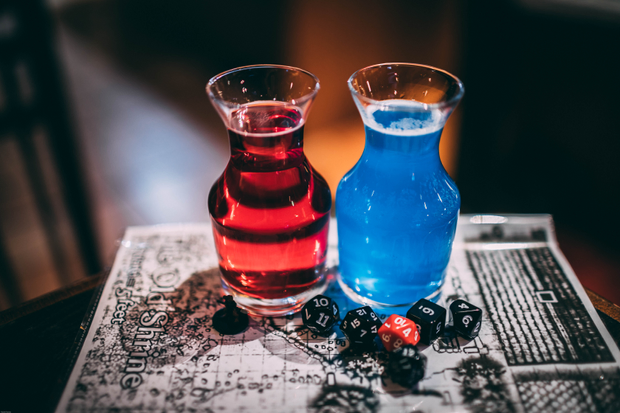

# Mana Potion (2015-2020)

> By Kayla

Last I left you, dear reader, we were on the topic of the 2014 Mana Potions. It's honestly crazy how many iterations this drink has been through for such an iconic Tavern item.
Mana Potions got Kinky?

So what of the variations after 2014, you might ask. Well, between 2014 and 2016, it gets tricky. Two significant variations appeared in this time frame. The first change to the recipe involves dropping Hpnotiq for Kinky Blue. It is as follows:

[Mana Potion 2014](https://agreeable-mud-04cfbdd10.5.azurestaticapps.net/drink/481/ManaPotionv4)

This version shows up in an early 2015 drink guide and the official re-codification of drinks in 2015 and 2016. I think we may have swapped to it sooner, but I have some incomplete records in that time frame. Kinky was swapped in to keep a price bump from happening to the drink. It's a cheaper alternative to Hpnotiq without changing the taste and color much.

The other version...is lost to time. I'm sad that I could not find it in any records other than the stories of bartenders I asked. No one quite recalls how long it existed. Perhaps I'll find something later and will update you all.
The Rouge Potions

In a previous post on the Mana Potions, you may have read that we actually received hate mail over the Mana Potion color. This next variation is what I will dub a rouge variation.  A bartender who was feverishly part of the "Mana Potions must be bright blue" category made their own variation that actually caught on for a while.

Rouge Mana Potion #1(Potion Bottle)
- 1 oz Kinky Blue
- 1 oz Absolut Berri Acai
- Fill Smurfs Blood

The Problem is, one Rouge variation always brings other rouge variations. And so, this abomination was created.

Rouge Mana Potion #2(Potion Bottle)
- 1 oz Kinky Blue
- 1 oz Absolut Berri Acai
- 1 oz Blue Curacao
- Fill Smurfs Blood

These versions are worth historical records in this document as they both had their fans. It gave birth to the bright blue and bright cobalt blue variations of the Mana Potion. And because these existed, they would shape the path of the Mana Potions future.
An Icon

After 2016 however, the Mana Potion would stay unchanged for a while. Ionic in Dark blueish purple form till late 2018. We started to have issues with ordering Absolut Berri Acai. It would be backordered or just not show up.  SGWS informed me on Aug 21, 2018, that it would no longer be carried.

Change had come again to the Mana Potion. The 2018 variation was spelled out in a quick addendum to the drink menu.

[Mana Potion UV Version](https://agreeable-mud-04cfbdd10.5.azurestaticapps.net/drink/478/ManaPotionUVedition)

The True Blue color of the Mana Potion prophecized by the Rouge variations had come. We wanted something that looked cool and really could replace the mystical-ness of the Acai. UV Blue was something we already had on our shelves for a few other drinks. It met the requirement of "being cool," and it was well-loved by many regulars for shots. And so the 2018 variation was born.
The end comes

This is where we would have left the main story of the Mana Potion. Comfortable in its bright blue coloration, this is where I'd assume we would have left it. But 2020 came and changed that one last time. A poorly timed backorder of UV blue left is to 86 the Mana Potion. It was a popular shooter with a few of our regulars, and even at a high par, it was no match for power-pandemic-drinking. We needed to keep the mana potion on the menu for people to enjoy. So here is the final Mana Potion Variation.

[Mana Potion Apocalypse](https://agreeable-mud-04cfbdd10.5.azurestaticapps.net/drink/477/ManaPotionApocalypse)

So we end the proud story of the Mana Potion. I hope you've enjoyed it. I know I have. For the end of the month, we'll be diving into the Mana Potion Modification drinks such as the Health, MP, and HP potions!