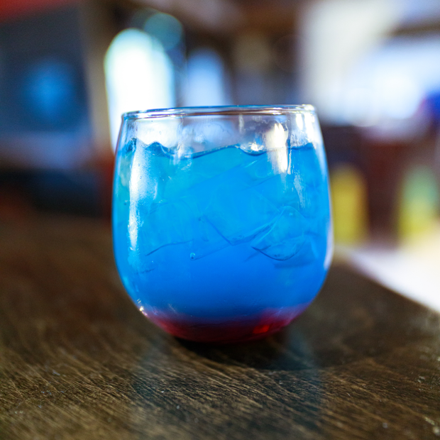

# Pre-Launch Alpha Mana Potion

>By Kayla

The mana potion appeared on the first business plan in 2008 when AFK was still called "Nerd Bar" on my early Google Doc. Back then, we had some very different ideas of what our liquor selection would look like, so the drinks were less functional and more about the image it evoked.

As you can see, this is not even close to how the more modern Mana Potion looks. This version even went through modifications up to the day of launch. But the Pre-Launch Alpha recipe once served in my living room was this:

[ManaPotion](https://afktavern.com/drink/186/ManaPotionAlpha)

Serve the Mana Potion in a wine glass. You want first to add the Chambord, then ice. After that, pour your vodka, gin, and rum, then fill Gatorade and BAMMMM; you have a Pre-Launch Alpha Mana potion.

So why all these things? Well, Hpnotiq has a cool name, and its color is beautiful. Chambord was for the bottle shape(yes really), being the holy hand grenade of liquor. Berri Acai, because it's a mystical berry that new age folks were going on about 'special powers.' And the rest...because it's what I drank! The Keen-eyed should notice this drink as based on a Black Opal. As it's almost a Black Opal, the Rum and Gin fell in line for no particular reason.

Lastly, you might be wondering, "why Gatorade?" At the time, I felt like an energy drink would be pushing this drink a bit. I wanted it to be accessible to most drinkers. The Gatorade came about when I thought it would be the recovery part of the drink. I liked using sports drinks as mixers at home. In place of sours, they could make some enjoyable colored drinks! So I ended up using it to color the drink blue.

With the powers of a sports drink for recovery and the weird mystical powers of Acai Vodka, this drink was destined for great things. It was first served to my friends at an RPG game night at my house. They liked it, and so it made the list. But its future would change and evolve with the Tavern. Next post, we go into the Release and Modern mana potions up to the current Apocalypse version and the other variants that have existed over the years.