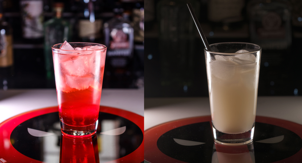

# Deadpool's 4th Wall

> By: Kayla

_"You do know Deadpool's color is Red, right?"_

_"For a bar that claims to be about nerd culture, you figure you could at least get what color Deadpool is correct!"_

_"I ordered the Deadpool drink; this one is yellow."_

I can't recall the number of times I have heard or read these comments. They are right; the Deadpool's 4th Wall is yellow despite being a Cherry Amaretto lemonade drink. This complaint wasn't a weekly occurrence; we got it once every two to three months. However, it was enough that I used to have the staff tell everyone who gave the drink to explain why it was yellow: it is supposed to represent the "little yellow boxes"/yellow speech bubbles. I also decided to help clarify through the drink description in a menu so that you could get a red one if you ordered a Deadpool-Island. Even if I joke about it now, it pained me to see customers getting something they didn't enjoy, so the Island was a good fix.

Also, as one super Deadpool fan pointed out to me one day, "You know he has a yellow suit when he's with the X-Men." I miss learning fun facts like that from random bar people.

[drink](https://afktavern.com/drink/623/Deadpool's4thWall)

[drink](https://afktavern.com/drink/613/DeadpoolIsland)

[drink](https://afktavern.com/drink/630/Deadpool's4thWall(Non-alcoholicversion))

[drink](https://afktavern.com/drink/613/DeadpoolIsland)

[drink](https://afktavern.com/drink/636/DetectiveDeadpoolkachu)