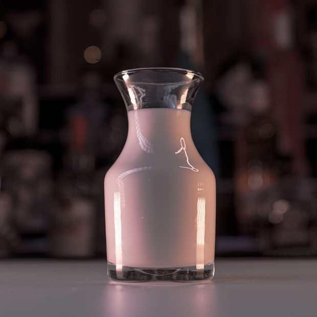

# Lon Lon Milk

> By: Kayla

The Lon Lon Milk hails from the very first Zelda Night Theme Menu. It was nestled between the Red and Blue potions but would outshine both of them combined. While never breaking the top 5 drinks of the Tavern, it often lived a comfortable life in the top 10 or 20 cocktails. When making this potion, we wanted it to be creamy and enjoyable by the target demo that was Zelda fans. Knowing how well Kirby's Adventure had played with Nintendo fans, we took direction from that and started with the idea of "strawberry milk."

However, we wanted to keep it white-ish in color to be in line with the white pixel art. The first version was way too pink. We then scrapped that idea and went tried using some Tequila Rose. It then tasted like Cream that looked like someone showed it a badly drawn picture of a strawberry from 20 yards away. So we RNGd into using Franjelico to give it a nutty flavor, at that point, we were on to something. Everyone trying it enjoyed it, and like that, it was on the theme menu and into AFK History.

[Lon Lon Milk Original](https://afktavern.com/drink/180/LonLonMilkOriginal)

Now over the years, the American Honey Whiskey would be swapped out for many things. Evan Williams Honey (2016-2019), Jack Honey(2015-2016), and Vikings Blod(some of 2020). If you're looking to dial the experience a little better, grab the version that works for your timeline.

Here are all the modifications of the drink:

[Lon Lon Milk Remastered](https://afktavern.com/drink/470/LonLonMilkRemastered)

[Lon Lon Milk Apocalypse Edition](https://afktavern.com/drink/468/LonLonMilkApocalypsev1)

[Lon Lon Milk Apocalypse Edition v2](https://afktavern.com/drink/469/LonLonMilkApocalypsev2)

[Lon Lon Milk Anniversary Editiodtion](https://afktavern.com/drink/467/LonLonMilkAnniversaryEdition)

[Guardian Potion](https://afktavern.com/drink/451/GuardianPotion)

[Yellow Potion](https://afktavern.com/drink/574/YellowPotion)

Fun fact the Yellow potion was made for the Lactose Intolerant folks who wanted to enjoy the cocktail.