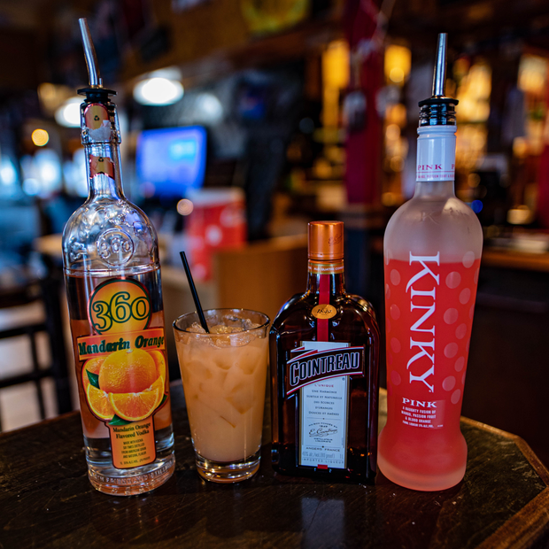

# Full Power Suit 

> By: Kayla

Our journey continues into the history of AFK's Power Suit Samus cocktail. Much of what we will cover today is minor changes to the overall drink. Plus, a cost reduction that resulted in a version of this drink widely considered a spectacular failure.

Let's get that spectacular failure out of the way. During the transitional period between Government-run Liquor and Distributor-run Liquor, there was a point where it was very confusing what distributor had what brand. We could not find X-Rated at all. It is one of the key liqueurs involved in the drink, so we had to find ourselves a replacement. We were not finding one that fit our price point; a vendor pointed out that OR-G was pretty much the same. So we picked up a bottle and swapped the recipe. I'd love to say I tried it and was like, "oh yes, it's the same," but I didn't and learned hard from this lesson. It tastes nothing like X-Rated, and it made the drink VERY different.

[Power Suit Samus #2 Failure Edtion](https://afktavern.com/drink/502/PowerSuitSamusv2)

You will note that Cointreau also replaced the Grand Marnier at this point. The change was due to the liquor handover and a scramble to find our old product. The Orange Garnish was ditched as well sometime in this version for unknown reasons.

Power Suit Samus enthusiasts so hated this version I received calls on my cell phone at 1 am to ask why I had done this. Yes, the joys of nerd culture. I got on this pretty quickly, considering all the other things going on. Our friends at Yong's Market pointed on Kinky Pink to us as we already carried the Blue version. With that change, the longest-running version of the drink was born!

[Power Suit Samus #3](https://afktavern.com/drink/503/PowerSuitSamusv3)

But our story doesn't end there. Aside from swapping types of orange vodkas back and forth, the recipe stayed unchanged till late 2018. This change is where a common 'oops' from the bartenders became standard.

[Power Suit Samus #4](https://afktavern.com/drink/504/PowerSuitSamusv4)

You see, many of our other drinks that had Pineapple & OJ also had a splash of sprite. So many of our staff just added it naturally. This version just finally put it in the recipe.

The power suit would have remained mostly unchanged if it wasn't for 2020. Like many of our popular drinks, the Power Suit had a few Apocalypse Versions.

[Power Suit Samus Apocalypse Kit](https://afktavern.com/drink/501/PowerSuitSamusApocalypseKit)

The Apocalypse kit was a strange variant. In the early days of the shutdown, we were allowed to sell 50ml(~1.6oz) sealed bottles of liquor. With these, we made kits to make yourself our drinks. Most of the mixers were out of a shortage of supplies and money to buy them. We used Pineapple rings because the week before the shutdown, we had bought 2 cases in our order, and we needed to do something with them. The Orange Soda was because we had three bibs of it and needed to move through them. All of it was to go through things we had on hand. It, however, made a fantastic drink! This cocktail is my personal favorite of all the versions.

[Power Suit Samus Apocalypse Version](https://afktavern.com/drink/840/PowerSuitSamusApocalypse)

The final version of Power Suit served at AFK was because of how popular the Apocalypse kit was. We didn't want our drink list to go 'back to normal' because nothing was normal. We wanted our menu to reflect that. I always intended our drink menu to go back to normal...but we all know how that turned out.

Thanks for joining me for another week in AFK drink history. Next week we go into the very personal origins of the #V. The Vote is up for the next drinks already. Be sure to vote!