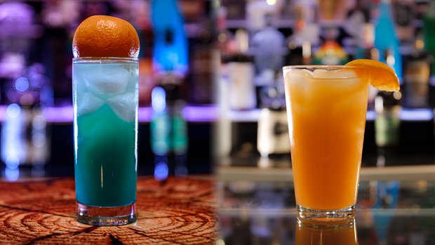

# Samus and Suits

> By: Kayla

Gather round ye drinkers; I must spin you a tail, one of the early days of the Tavern and its drinks.

Before we start down this road, I'm going to let you all in on something. I am highly embarrassed by the origins of this drink. I felt it left a black mark on my menu for a while, even after correcting it. **The evolution of the Power Suit Samus was one of the defining moments for AFK.** It dictated how we'd vet drinks and our operational "handbook" on making cocktails.

Way back in November 2010, when we were throwing our doors open to the world, we were flooded with input. One suggestion was to expand the drink menu to include more references, so I asked our bartenders for ideas. That is how we ended up ripping off someone else drink recipe called the Zero Suit Samus. Given ours was not an exact copy, it still was close enough to be severely embarrassing. It wasn't the bartender's fault, or the customer who suggested its fault. It was my fault for not checking on its source. It wasn't the only drink in that batch that was ripped from memedom and, in turn, ripped off from someone one else in the industry. While it's not truly illegal to do this kind of stuff in the bar industry, most of the time, it's in poor taste. It would later cause a hardline policy; all AFK drinks were AFK only and not taken from other sources.

In one December reprint, this cocktail was modified but maintained the name due to popularity and exhaustion from the first month. The recipe was as follows:

[Zero](https://afktavern.com/drink/379/ZeroSuitSamus)

I will point out this recipe was severely short-lived and killed one night in a re-write fervor. I recall sitting at the bar with a printer hooked up to my laptop, talking with Kara about all the drinks we were disappointed in. At some point, the Zero suit came up. It was weird we had a cocktail based on Samus's fan service and not her regular badass suit. Given the shame of the drinks organ and that embarrassing factoid, we decided to rework the entire thing. Working together with help from other staff hanging around reforged this cocktail into something we could be proud of!

[Power Suit Samus #1](https://afktavern.com/drink/499/PowerSuitSamus)

The Power Suit Samus was born to the AFK menu. Not only was it something we were proud of, it truly kicked the ass of its predecessor, maintaining to be one of the top 5 drinks even at AFK's end.

Now, this cocktail, like many of our drinks, changed over time. Next week I will be going into all the variations and modifications of this badass AFK drink.

*Keen-eyed observers may know that the Tavern didn't have Collins Glasses in the early day. We had these weird tall wavy glasses from some Japanese beer. We used those for this drink.