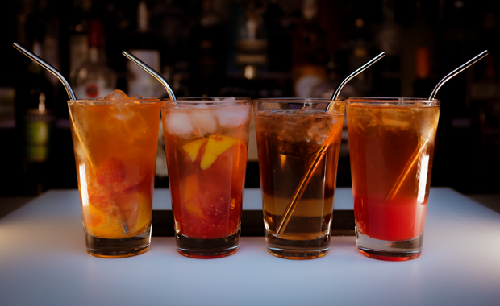

# Sereni-tea

> By: Kayla

Sereni-tea joined our menu sometime in 2011. It came about from seeing a bottle of Firefly vodka and going, "well, I know what I'm going to make with that." It's skyrocket to fame started from that point.

This drink saw almost no modification over the years. Perhaps because it was perfect in its original form. It did spawn a few variants that I'm excited to share. Let's get the first, the OG, the best in class Sereni-tea, out of the way first.

[Sereni-tea 2011](https://afktavern.com/drink/270/Sereni-teav1)

[Sereni-tea v2](https://afktavern.com/drink/518/Sereni-teav2)

[Sereni-tea stable?](https://afktavern.com/drink/617/Sereni-tea)

When making this cocktail, you will first want to add all the fruit and muddle it till the lemons and orange are fully juiced. Then add ice, pour the vodka over the ice, then fill with Sprite.

One of my favorite modifications that came from this drink the "Sereni-tea" (the movie.) A mod in spirit, the only part remaining is the name and the Firefly vodka.

[Sereni-tea (the movie)](https://afktavern.com/drink/517/Sereni-teatheMovie)

The next modification hails from a 2016 theme night. Taking a berry different take on the original.

[Sereni-tea Engineer](https://afktavern.com/drink/516/Sereni-teaEngineer)

The process is much the same as the first modification. The strawberry takes a little more time on the muddling. Adding the Lemonade fill makes it very easy to down quickly.

Because 2020 was the year it was, it spawned an apocalypse version of this drink. It was one of the last drinks I poured on our final night of in house service.

[Sereni-tea Apocalypse Edition](https://afktavern.com/drink/515/Sereni-teaApocalypse)

That's it for the Sereni-tea. It's a relatively short history, mostly because it maintained being unchanged for nine years. I hope you've enjoyed the Firefly drinks this week, and don't worry; there are more to come.