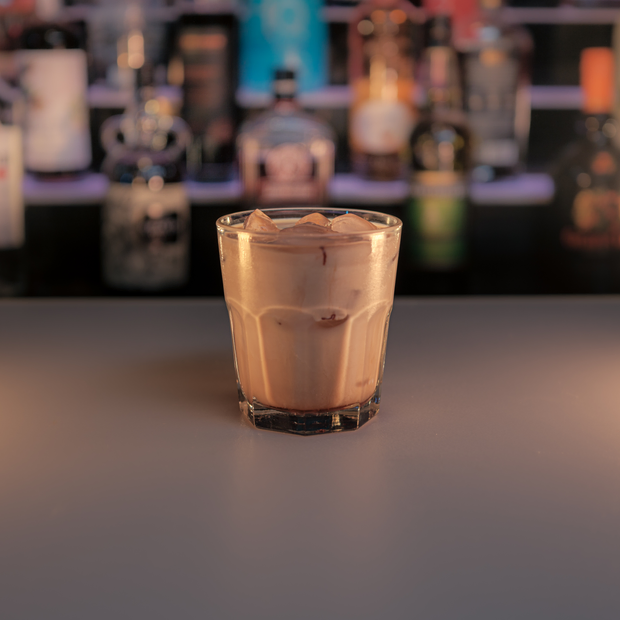

# Ship and a Gun

> By: Kayla

Seeing how the Sereni-tea is shaping up to be our next drink recipe dive. I thought I'd share another Firefly reference from the menu. Coming from the 2018 Firefly theme night menu, this drink found it's spot on the main menu from the sheer volume of requests for it. This cocktail twice a modified version of modified Smith & Wesson called a Colorado Bulldog plus Creme de Cacao. The similarity to a White Russian lent it to be a trendy drink with the wander-ins.

[Ship and a Gun](https://afktavern.com/drink/275/ShipandaGun)

Make sure to stir a little after you pour in your ingredients. For Coffee Liqueur, we used Kapali at the Tavern as our go-to Coffee Liqueur; I made the one in the photo with Grind, and it gives it far more of a kick. This cocktail is a perfect dessert drink for after a meal or breakfast before you load up on your starship.