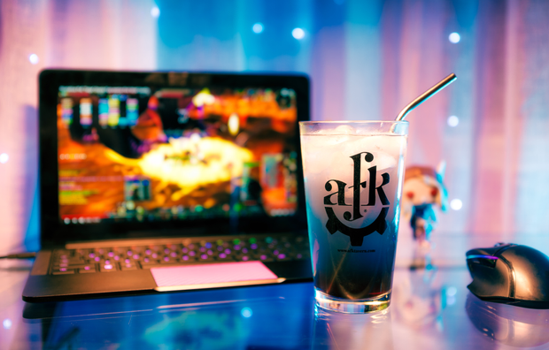

# The Onyxia

> By: Kayla

The Onyxia was a classic AFK drink. It's sales spiked in the summer and was popular, not just among World of Warcraft fans but everyone. This drink had a broad fan base; I've spoken to many customers whose first introduction to AFK Drink's was the Onyxia.

Even though it joined the menu in 2013, I can't even picture the AFK menu without it. The Ony-kits in the shut down helped keep us going. Even it's modifications ended up as fantastic sellers, many sticking it out to the final days of service. The Onyxia was a hero drink for the Tavern, and it will always have a special place in my heart. Let's get into how to make it so it can make a special place in yours.

[The Onyxia Classic](https://afktavern.com/drink/329/TheOnyxia)

[The Onyxia 2016](https://afktavern.com/drink/554/TheOnyxia2016)

[The Onyxia Apocalypse](https://afktavern.com/drink/555/TheOnyxiaApocalypse)

These were the most common version of the drink. The only real change came in during the shutdown when the only vodka we could get for the Ony-kits was Huckleberry Vodka. We ended up making a mixer that worked, and during limited operation, it joined our menu as a standard drink because people loved it. I still love it, it was one of the best things to come out of that time.

Throughout the years, the Onyxia gained quite a few variations. Some, like the Nefarian, were very long-lived, while others like the Alexstrasza were small blips.

[The Nefarian](https://afktavern.com/drink/553/TheNefarian)

[The Sinestra](https://afktavern.com/drink/558/TheSinestra)

[The Sinestra Apocalypse](https://afktavern.com/drink/559/TheSinestraApocalypse)

[The Alexstrasza](https://afktavern.com/drink/547/TheAlexstrasza)

[The Ysera](https://afktavern.com/drink/562/TheYsera)

The following were cut from release menus and left in drafts. We'll call the section the cutting room floor. There were some others from brainstorming docs, but I have had both of these, and they were good enough o be on the main menu.

[The Malygos](https://afktavern.com/drink/552/TheMalygos)

[The Chromie](https://afktavern.com/drink/549/TheChromie)

_A fun final fact, the Sinestra was named after my cat Sinestra, not the WoW dragon._