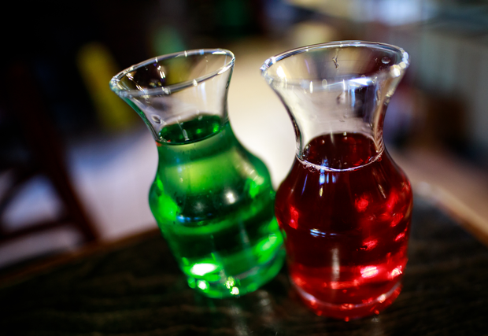

# The Mana Potion's Wierd siblings

> By Kayla

Drink Modifications have been part of AFK since the first year. They started as a way to have the menu upsell you on an item without server intervention. But they ended up becoming a way to condense down cool drinks that were part of larger families. But what makes a family of drinks? The mana potion helped us define that, but there were some pretty out there missteps along the way, as you will read.
Fill up your hearts!

The first we will cover is from the early days of AFK and lasted at least two versions of our quarterly drink menu. Straight from a Zelda theme night, the Red and Blue potions! *fans cheer here*

[Red Potion](https://afktavern.com/drink/508/RedPotion)

[Blue Potion](https://afktavern.com/drink/419/Bluepotion)

Now, as you may note, the blue Potion didn't come out blue. And neither of these "potions" have any recipe relation to the mana potion. The Blue Potion is pretty much just a Potion of Blur with Blue Curacao. Both drinks maintained popularity due to their reference, but the Red Potion would outlive its counterpart for a few menus. But both would end up being axed as we started to build standards for "mods."
Points vs Potions

One of the other short-lived siblings to the mana potion was the MP Potion. This variation showed up on one printing of an E&E menu before vanishing to the archives of time. It shows us a very different path that the mana potion could have walked.

[MP Potion](https://afktavern.com/drink/472/MPPotion)

It created a purple, blue drink made of sparkles. And while the cocktail it's self was just eye-popping ultimately, it was too confusing to some customers who thought they were ordering a Mana Potion. It was cut from the menu in a reprint.

However, it had a sister drink, the HP Potion! This drink would live as a Mana Potion mod till the very end of the Tavern. Now you might think that it was strange that we didn't have a "Health Potion." At some point, we were told by an officer that we couldn't convey any cocktail as "healthy" in its name. Fearing the WSLCB HP potion ended up working out nicely. Interestingly enough, two common variations of this show up in some of the old menus.

[HP Potion](https://afktavern.com/drink/452/HPPotion1)

[HP Potion 2](https://afktavern.com/drink/453/HPPotion2)

We were just getting into the put vodka in it and make it red category here. But vodka + cranberry is classic for a reason; it works.
Are we trending?

Some of the other mana potions modifications, sadly short-lived, reflected on trends in gaming. The Potion of Prolonged Power first showed up in version 7 of the drink menu. It sadly returned to the archive after only one printing suffering the fate that many of its sisters had.

[The Potion of Prolonged Power](https://afktavern.com/drink/556/ThePotionofProlongedPower)

As you can see, this wasn't too far off from a regular mana potion breading a "true mod" that would help guide us on how mods would work in the future.

Further chasing that potion trend brought us to Dark Souls. Pulled from the moderately well-received Dark Souls theme menu in 2017, the Ashen Flask shortly lived on the version 8.35-reprint menu. Its counterpart "Praise the Sun" out soul-d and outshined it, causing it to be dropped in the 8.5 final menus for space.

[Ashen Flask](https://afktavern.com/drink/408/AshenFlask)

You can see the Mana Potion bones in this drink, but you can also see the echos of the Potion of Prolonged Power. I think it stands up as a good drink, and I regret seeing it go.
Apocalypse Green?

In the first part of the shutdown, before they gave us the green light for mixed drinks to go, the Tavern made do with selling drink kits. We couldn't do much because the availability of 50ml bottles became scarce very quickly. One thing in abundance was Kinky Green and apple whiskey. So we made a short-lived Potion of Agility. Because green is agile?

[Potion of Agilit](https://afktavern.com/drink/498/PotionofAgility)

And while technically, this doesn't have a lot of relation to the Mana Potion, it was sold as a mana potion mod on the website to drive sales to the Kinky Green and Mt. Dew we had in stock. I'd say this drink was closer to our cocktail called an Illidan more than anything else. But I have filed it under Mana Potion due to its association online.

And thus ends our wild ride into the weird history of the Mana Potion!