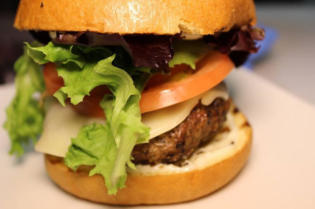
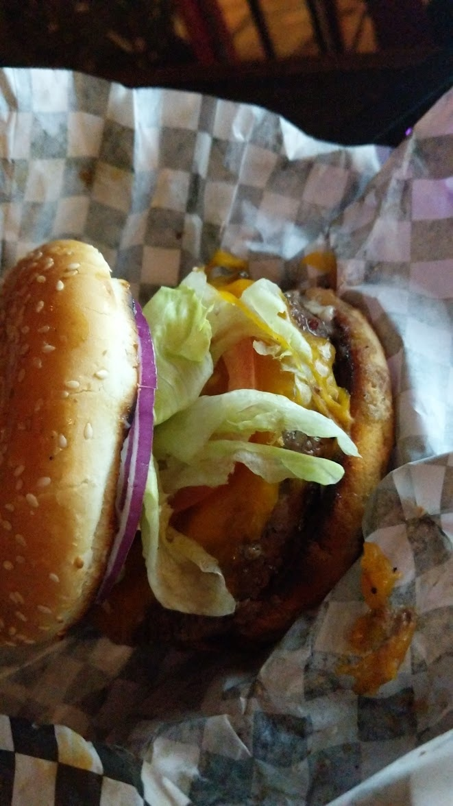

## The Dragon Burger
> By: Kayla

The second burger on the menu—the Dragon Burger, aka the Red Dragon Burger. A reference to the Red Dragon Inn, we dropped the "Red" from the name as people were perplexed about it in the first test runs of the menu.

The Dragon Burger was a simple spicy burger on the first few menu prints. But the innovation of a couple of cooks became something a little different. The First Dragon Burger was as follows: Skyfire Salsa, Red Onion, Pepper Jack Cheese, Mayo, Romain Lettuce, and Patty. But by the time we went live, we had started adding house-made Spicy Mayo and chopped habaneros to the top of the burger. The chopped habaneros would later alter into a "habanero sauce" with which the patty would be covered in.

Here is how to make the first version of the Skyfire Salsa.
(As always, know these were made to serve many)  
- 3 Red Onions
- 4 Limes with lime pulp
- 4 Vine Ripened Tomatoes
- 8 Jalapenos
- 4 Sprigs Cilantro
- 2 Dashes of Smoked Chipotle Sauce
- 1 Can Tomato Paste
- 1 Table Spoon Cumin
- Salt to taste

Now the Recipe altered significantly over the years, almost unrecognizable at times as different KM's decided it needed to be their way. People have opinions on salsa—lots of opinions. From Changing the Chipotle Sauce to Tabasco Sauce, Removing the paste, and adding more tomatoes, you name it! It caused many quality issues, from soggy buns to wild spice-level swings over the years.

Eventually, the Dragon Burger would just have Frank's Red hot added over the burger while cooking, and a small amount of salsa or Jalapenos added.

If you want to recreate your own, use the franks and jalapenos and add tomatoes to the burger. Much like the final incarnation of the burger before March 2020, this stopped the soggy bottom bun issue and helped with consistency in the product.

The Dragon Burger did have some of the strangest mods over the years. From just adding more patties to spicier and spicier variants. The Spicy variants eventually spawned our "melt your face off" nights, where we'd just have 4-8 kinds of salsa/hot sauces for everyone to try. We had to back off on those after a customer projectile vomited onto his party due to one of the sauces being way hotter than he could handle.

And some fun but also sad trivia, the last burger ever made at the Tavern (it went to me) was a Dragon Burger with cheddar cheese, sub BBQ(we were out of salsa and Jalapenos,) add extra franks (I found the last ticket recently, I actually had thought it was a different burger, I don't really remember the night well.) Here is the photo from my phone.
