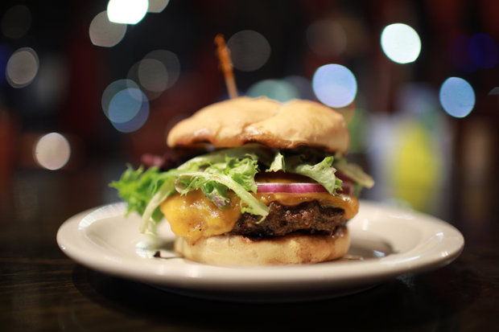
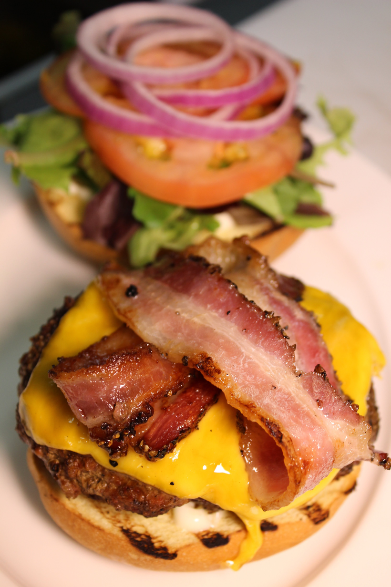
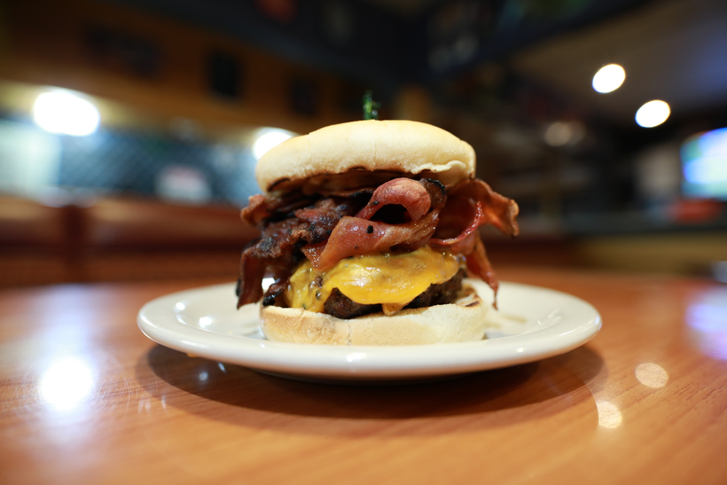

# The Normal & The Baconarok

> By: Kayla

**If you're like "hey I clicked on the Baconarok what gives" it's part of this story. Just scroll down.**

 I can only tell the story of the baconarok if I tell the story of the Normal Burger and it's mods first. So a tail of two burgers...

## A lesson in shifting social words and accommodation

When creating the first menu, I wanted a standard burger with everyday things that people expecting a typical burger would typically want. What would the word be for that? _Normal._ I wanted a _normal_ burger for _normal_ people. A burger any Sue Z Que could come in off the street and be like, "amidst all these nerdy references, at the very least, I know what this is!"  So I named it the Normal Burger. Even in hindsight, I can see all the events and even understand them, but the idea that this burger's name would upset so many blindsided me.

At some point, **Normal** had become an **insult** to some groups who frequented the Tavern.

The burger being called "Normal" got me more than a few emails, a couple of face-to-face talks, and one furious personal cellphone call starting in about 2017. You see, dear reader, I being the person I am, did not know the word "normal" as an insult in some communities; I would never have guessed it would have ruined the experience of so many people. I hadn't been bullied by someone chanting the word normal at me and, to my ignorance, had no idea it was a thing. I had other things had been shouted at me plenty, and I know I'd feel like shit if I saw one of those words on my local nerd bar's menu. So, with an attempt at empathy and understanding, I changed the name to the **AFK Classic Burger** and then later to the **Basic Burger**. After all, the burger was meant to be accessible after all.

All of these changes did have a very positive result! The people who contacted me were happy; working on this rename allowed me to spin off and rename the most popular mod of the burger, "add lots of bacon." (It had a troublesome name coined by the customers for other reasons that have only become more troublesome in the last couple of years, so we're leaving it out of this story.) I also wanted a new front-line burger to advertise our new menu rollout. All of these changes worked well, and even if getting my cellphone called at 11 am on a Sunday freaked me out and was overstepping lots of boundaries (also don't do this to people), with hindsight, it was all a positive change.

## The Bacon Apocalypse

Monthly starting in 2013, we had been running Bacocalypse nights, half of everything bacon. We did these on slow nights to drive up business, and while not extremely popular, they did have a customer base. On analysis of the Bacocalypse sales and trends, there were some ideas we could exploit; we decided to use some of the specials it ran as menu items, like The Right Choice, and add eight slices of bacon to anything mod. This change, of course, hugely influenced theme menu food going forward.

Out of all the theme nights at AFK, four were the most constant money-makers. Number one on the list is Warrior Night. Naturally, I decided to bring a bit of warrior night into the main menu in my 2017 and 2018 redesigns. And was born the Baconarok!

## Baconarok has come

A stack of bacon, sauteed onions, cheese, patty, mayo, and bun. A simple yet wildly successful burger. This burger didn't win the all-time best seller because it came in late 2017.

It also had some hilarious mods over the last years of AFK. Steakonarok (added steak), Baconarobock (had chicken), Bacononbaconork (3x bacon), and the Fakenarok (A vegan version I made for fun and sold a handful of on a couple of Tuesday specials.)

Back to Basics

Sometime around late 2018, the Classic swapped over to the Basic as we rolled the Dragon, Street Samurai, and Veggie burger into one line item. (The Dragon would shortly become its own thing once more in the end times.) Combining these as mods helped sales on all of the items. Something I keyed into early on at the Tavern was our demographic likes guided choice on upsells with transparent prices. Most of the time, when mods popped up on a menu, it was to drive sales in that direction. Sometimes it was me taking wild swings at new ideas.

The wild ride of an accessible burger encapsulated a lot of lessons learned over the arc of AFK. Don't assume your audience, Don't cater items to ignorance in a niche setting, and never assume your experience is the only narrative. I had these things hammered into me year after year, but this one adventure with a normal burger is a happier story than all the others.

_Notes:_

_The Basic name did well; a lot of goto line 10 jokes and questions if it came with pumpkin spice—something big about owning being basic going around that year. We did make a pumpkin spice version, it was better than expected. After renaming it back from Classic, sales picked up big. I didn't have classic wow to make jokes off of...that would have been killer synergy._

_Some of the dates on this were squeaky, technically, the first angry note I got about the name was in 2015, but the flood was later._
