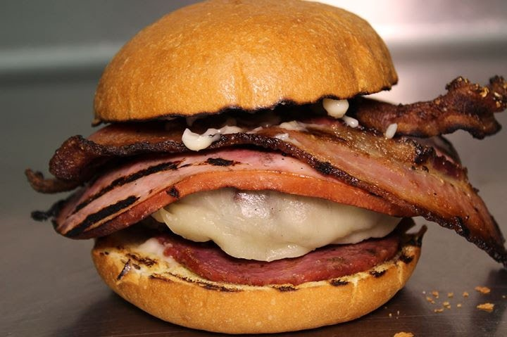
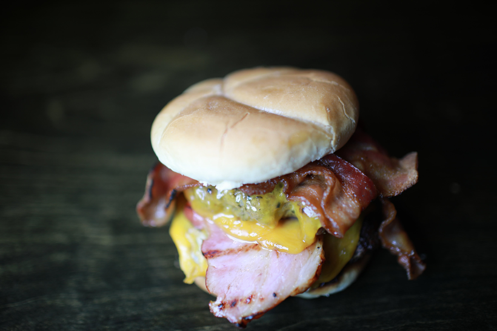

# The Orc Burger
> By: Kayla 

I wanted to start this food side quest with something **central** to the AFK theme. We talked about Pizza dough, even where to get all the special fried food we bought. But AFK had a lot of one thing since the day it opened: Burgers. 

Many of you may know that food wasn't even supposed to be a central theme at the Tavern. In early drafts, I wanted to have snacks and booze only. Yet, legal requirements and licenses changed that idea. So we went with basics, and basic was burgers. 

The first burger to ever exist on the business plan was the Orc Burger, so today, we're going to run down the entire history of the Orc Burger, every rendition, and mod (thanks to the help of some ex-employees.) So here goes what might be the longest post about food I've ever done or will ever do. To boot, it's also only about the Orc Burger.

(the orc burger 2014)
## Here and b-orc again, and Orc's journey.

There was a demographic all about meat. This group wanted every part of their life to exude meat. In my anecdotal experience at the time, a large portion of this group resided in what we assumed core demographics of AFK would have. Looking back on that assumption and I laugh, as it not only proved to be correct, but it also proved to be a demographic that would spend more on food and drink. 

Enter the **Orc Burger**! Imagine a burger designed by someone who has not eaten meat for people who eat meat. That is how the Orc Burger came into this world, as a meme. It was everything meaty we planned on having in our first inventory list on one burger. Later that would change, but the "everything meat on a burger" would live on with the Warchief.

>"Four slices of thick peppered bacon, salami, one grilled thick cut of ham,  Orc Patty, your choice of cheese, and no wussie greens." The first Orc Burger. 

Now you might be asking, what in hell is an Orc Patty? The Original idea was a ground Bison, but that got scrapped early. An Orc Patty just became Early AFK vernacular for 1/2 pound patty. Orc Patties became a problem early on as we used two different sizes of ground chuck patties. In the early days, we had Normal Patties at 1/3 pound and Orcs coming in at the 1/2 pound—two different prep items. 

The patty problem caused some confusion in the early days. You could upgrade to an Orc Patty on anything or add a Normal Patty. Price scaling on these was linear and equal, yet people rather the 2 Normals vs. just bumping up the little bit to an Orc patty. The problem caused the Orc patty to be cut fast in the early days and the Orc burger to have two 1/3 pound patties. Later, when the bakery discontinued the buns we were using, we returned to 1/2 pound; however, it became the standard for everything. It looked better on the Bun than the 1/3 pounder, and we felt more comfortable serving it.

The Bacon choice for the Orc Burger, that thick-cut peppered bacon, informed the bacon choice for the entire menu. Everything would have thick-cut peppered bacon for years. At first, it was a delight to most customers; it was premium quality bacon cooked on a grill. Everything it was on gave that unique AFK taste to it. I can say that AFK's food journey would have been different without the peppered bacon. In the early days, it was complemented and beloved, plus people used it as an addon for everything, including a few drinks. 

However, in 2017 as you might recall, peppered bacon went away. This change was due to a nexus of events. Bacon prices had been creeping up, and we had just done a hike on all bacon items. At the same time, around 2016, the number of reviews, emails, and in-person complaints about the peppered bacon skyrocketed. Typically how it was too spicy or too peppery. It was enough that I decided I didn't want to deal with it any longer. I killed two birds with one stone and changed over to thick-cut bacon.

The other thing that changed on the Orc Burger over time was the Salami. An ingredient shared with the doomed Pixie Pasta Salad from the first menu. We'd go on to shoehorn it into dozens of other dishes trying to keep it on the Orc Burger. In the end, the cost and consistency of the Salami started to get shakey around the same time as bacon. We received two green logs in a row from our distributor after other quality issues. These problems were also during the dawn of the AFK pizzas, so we chose pepperoni to replace the Salami and stopped carrying it. 

Despite the changes, the Orc still maintained as a top seller. We brought back Salami with peppered bacon every once in a while and would do small runs of Orc-a-burger Classic. Hardcore Orc Burger fans would often remark positively on the changes after trying the OG. It was something special that the burger could change and the fans stay the same. I recall boxing up the very last Orc Burger for a customer, drawing a smiley face on the box, then handing it to the customer and telling them, "that's the last orc!" With a mixed bag of emotions. The Orc burger, in a way, helped shape the entire history of the company. It rolled with the blows, changed with the times, and still was a fan favorite up to the last one...damn it's dusty in here.

(The orc burger 2016)
## How to Build an Orc

I'm not much of a food recipe person. A burger is usually cooked like a burger. Trying to write tempters and things, just not my style. If you need assistance, there are far more intelligent and talented people on the internet who can teach you how to make them. I feel I would fail in this regard. So what follows is how to build an Orc if you are familiar with the burger-making processes.

The first requirement to build an orc is the patty. The traditional way to do that is with Lean Ground Chuck. The meat should be formed by hand, roughly pressed flat, seasoned heavily with Montreal seasoning, then grilled. Once cooked, it should be quenched in beef broth and thrown back on the grill for a few minutes. Most Orc-Burgerers liked their patty medium to medium well. 

The second requirement is the bacon, peppered or not; it should be thick cut, par-cooked, then finished on an open fire grill. 4-8 strips of bacon were within the normal range for most people who ordered it, so go wild.

The third requirement is the ham. Thickly cut, you want to grill the ham up to the same temp as the bacon.

The more flexible requirements come in with the Salami or pepperoni. The Salami would be cooked alongside, sometimes on top or next to the ham. The pepperoni would usually be placed on cold or warmed in a saute pan.

Even though not brought up in this story, the cheese is critical to the success of this burger holding together. While you're free to go cheeseless, if you are a cheese person, the Orc was always meant to go with Cheddar, pepper jack, or Swiss. Take your pick.

Lastly, the Bun, the most common Bun for the Orc, was the brioche bun; its second-longest run was with the beloved Pub Buns. Mayo or no Mayo is an argument left to time; go with your heart. 

To finish your Orc, the order or assembly (this has changed somewhat over the years) should be Bottom Bun, Salami (or pepperoni), Ham, Patty, Cheese, Bacon, and Top Bun. If you've chosen two 1/3 pound patties, place the other patty below the ham, and add another slice of cheese for stability.

### Modifications 
    - Or40k - Add one huge grilled portabello mushroom cap
    - Take Back the Farm - More Cheese
    - Fel - Replace Bacon with Gyro Lamb Strips
    - Oracabo - Add a fried Egg
    - Warrior - Add another Orc Patty and two slices of bacon
    - The Lo-orc - Use a Chicken Patty
    - Shaman -  and lettuce, tomato, and onion (also was for a salad for a short time)
    - Warchief - We'll get into that later...