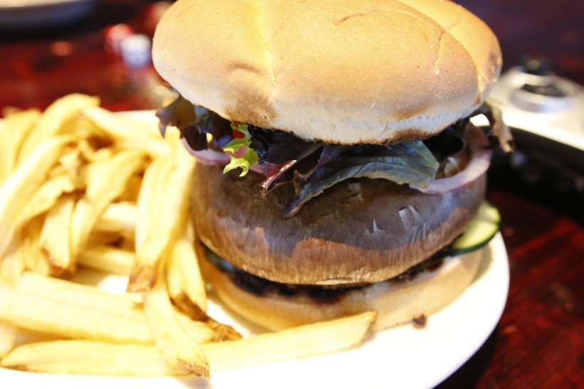
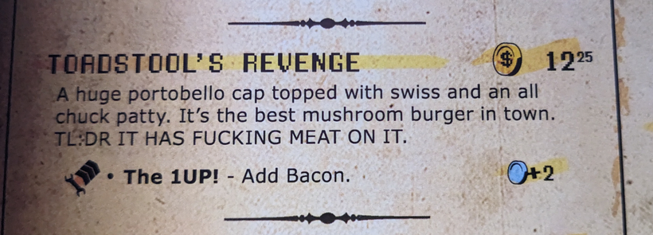

# How to mushroom burger the wrong way

> By: Kayla

Sometimes items were lost in translation. This one was due to me never having a pub mushroom burger in my life. The mushroom burgers I made for myself were just one giant grilled portabello mushroom and fixing. So when it came to adding a mushroom burger to the first menu at AFK, I had it all figured out. Step one, giant portabello cap doused in vinegar, oil, and spices; step two, slap on some cheese and a massive burger patty; step three, profit. I had no idea that this wasn't the normal thing to do.
TL;DRs

This misunderstanding of how the burger world works is how the Toadstool's Revenge started. A burger that began in ignorance and was plagued by confusion for its entire run. Some of you may recall this burger had the line "TL;DR IT HAS FUCKING MEAT ON IT" in all caps in the description.

Many people laughed at this, but it was there due to weekly someone sending back a burger that clearly stated an all-chuck patty in the description for having said patty. When talking to these customers, I often pointed out that it was in the description; however, to my great pain, not one of them would admit to being illiterate. To help this, I added the warning tag in all caps in to hope this would help people order without meat if that was what they wanted. I am sure you all know how well that worked. While the frequency dropped, all it did was get more sheepish looks from customers when it was pointed out. (I honestly felt terrible most of the time and did refire the item, we've all lost the ability to read past the first two words of something on a menu from time to time.)

We did end up spinning off a Vegetarian-Friendly version with added fresh veggies that was quite popular.

## The 1UPinging

Like all things at the Tavern, as you may have noted, supply chain, consistency, and price ended up being these burgers' downfall. We started to have issues getting as large of mushroom caps consistently from our distributor, and the local prices for picking them up skyrocketed around 2016. Eventually, they were too often 86ed to be considered viable to keep on the menu.

So, Toadstool's Revenge would be replaced by a more popular version of itself. Named after the once-bacon mod, a sauteed mushroom, onions, and bacon burger would take its place. The 1Up never quite lived up to its predecessors' shadow.

The 1Up would last till the final week of the Tavern, however, and still had many fans. One of the most creative Mods that came out of the shutdown was the What The Actual Fuck burger, sauteed onions, way too much garlic, mushrooms, spinach, swiss, and a patty. It was one of our most popular take-out items and was created because we needed to get rid of an abundance of stock that would go bad.

The Toadstool's Revenge will always be remembered in my mind for the reaction people had when you brought it to their table. Their eyes would go huge, and many would go, "oh, that is huge." It was a joy to serve people this burger... unless they couldn't read :P