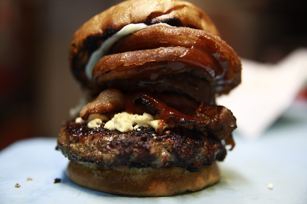
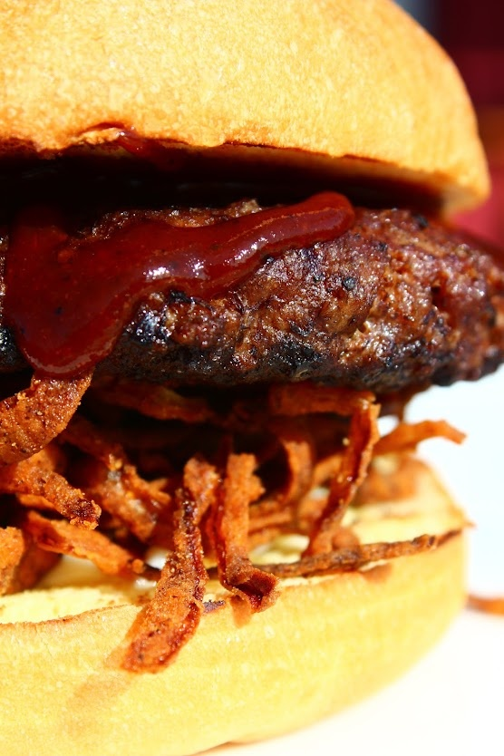
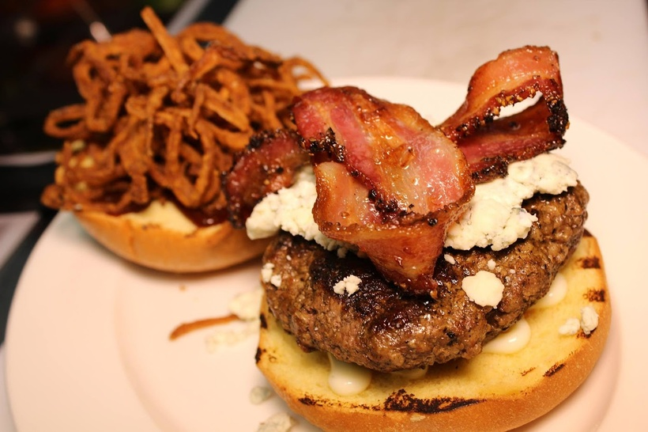
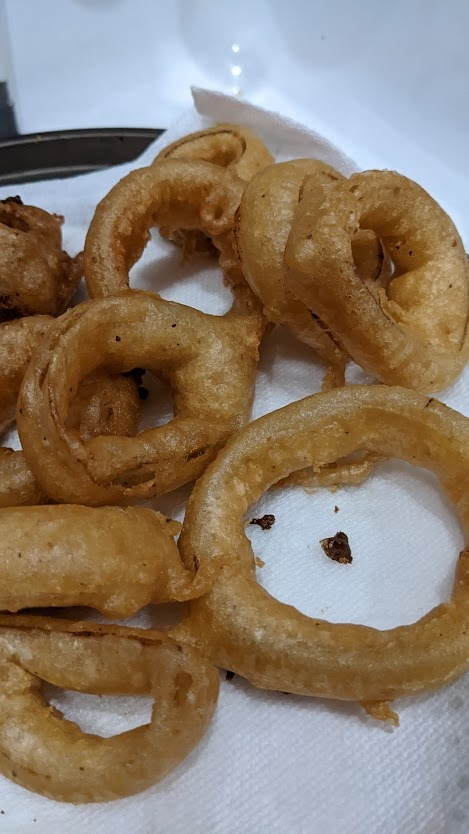
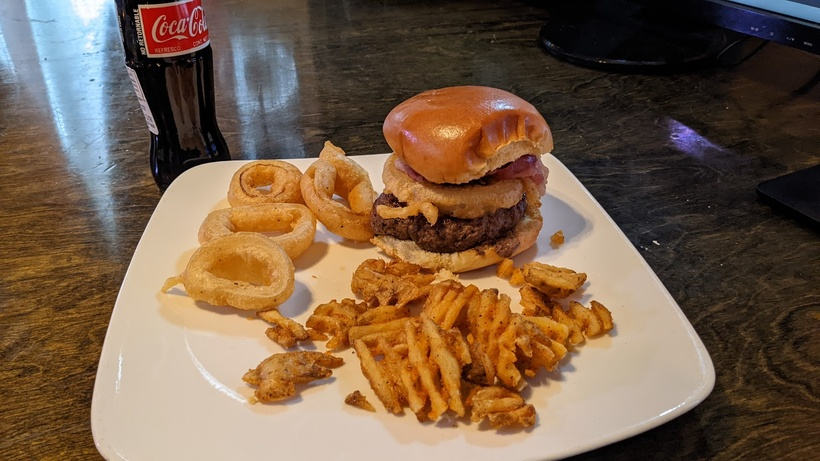

# The Witch King
> By: Kayla

## One Ring Burger to Burger them Burger

The One Ring burger was simple: an onion ring on a burger equals a LOTR joke. Naturally, it had bbq sauce on it and cheese. The mods that came from it on the early menus were the Mt. Doom subbing out the bbq for hot sauce, the Sam adding Ham and sauteed onions, and of course, the Elven Kings that involved the appropriate amount of added rings.

Now early on, we had very little control over the product we didn't make in-house, and onion rings, like many outsourced items, ended up coming to kick us in the ass. The company we were using for the onion rings fell from the portfolio of our local distributors. The new onion rings given as a sub were awful and cost more. So I insource our onion rings to our kitchen. At the time, this whole process didn't go well. We were still absolutely awful at any lead time prep items at the Tavern. Something that was strait forward to prep, no problem. Add in frying and freezing, which was a no-go; quality and consistency were all over the place. Doing batter on the fly just turned into a mess in the small kitchen space, so anything involving an onion ring was scrapped after a couple of weeks.

## Back To The Shire

In steps, the Spell Frizzled Onions, the hero of the Shire. Something the kitchen could make reliably, however, was frizzled onions. (Look, I know like three of you at this point are going to be like, "Kayla, what the actual funk? They're like the same funking thing," and I'm going to be like, "Friendo, don't even get me started, I had this argument like 30 times with the kitchen.") We brought back the One Ring in its next incarnation, the Shire Burger. The difference? Just the Spell Frizzled Onions.

## Something Witch-King this way comes...

At this point, with the lack of rings, the Elven Kings mod had to go, as it just didn't make sense anymore. So with an open mod slot on the menu, I brainstormed with the closers that night while writing up the new menu. Luke was pushing for bacon, bbq, and bleu cheese. He made some excellent points. He and Anna pitched me the Witch-King; I tossed it on the menu and sent it to print that night.

Quickly the Witch-King became the dominant menu item, eclipsing the Shire in sales. It was clear that the Shire was doomed.

## Time is a Crispy Ring

Bacon, Spell Frizzled Onions, BBQ, Bleu Cheese, Patty, and Bun. The Orignal Witch-King. A powerhouse on the menu, but all things must change.

Spell Frizzled Onions were becoming a problem. Appropriately made, they were quick and tasty. Done just a little wrong; they destroyed the fryer oil and tasted like carbon. A rushed cook often made them wrong, and it was becoming a quality and waste problem.

I had just tasted new onion rings from one of our distributors, and not learning from the past, I decided Onion Ring was back on the Burger. Due to the weirdly high per-ring cost, we wouldn't sell them as an app this time. Everything was perfect till we started dealing with constancy issues from the manufacturer as they became popular at other places. At first, it was just widely swinging size, boxes of all small rings. Then we started to get shorted on them a couple of orders a month. I was sick of dealing with one of the more popular items on the menu with interment 86s. At this point, I had brought on a full-time prep and ordering cook to help sort out many of these issues (it wasn't just the rings at this point.) I charged him with the task of making decent Onion Rings. He delivered, so we forged the one Onion Ring to rule them all!

## Beer Rings

Tempura batter, sub out the water for Odin's Gift or Freya's Gold—this became the simple Ring that would help Witch-King to keep a stranglehold on its #3 spot on the burger sales even with the massive sales shakeups going on. The idea with these rings was to make one MASSIVE beer-battered Ring, which was impressive and added to the overall experience of eating the Burger.

And so the final version...the last one to grace the menu. House-made giant onion ring, cattleman's bbq, bleu cheese, patty, mayo, and bun. Due to the custom onion rings, it was out by the last day. So I don't have the last one served image for you. The prep cook/ordering manager (Donald) and I did make some for our gaming group months back... so that photo will have to do.

### Some notes:

After frying the onion ring, cooking a fried egg inside the center of the Ring is incredible.

The BBQ Sauce used cattleman bbq. We did have some other versions over the years—quite a few hand-made one-offs by me. But also, the "Iron Mountain BBQ" was just 3/5ths Cattleman and 2/5th condensed expresso.

The Mt. Doom hot sauce was called the Red Ring of Death sauce. It was pure pepper extract mixed with whatever the cooks came up with that month to call a hot sauce. Later we replaced it with Dave's Insanity Sauce due to constancy issues.

The photo at the top is actually from a three ring special we did in 2019. 