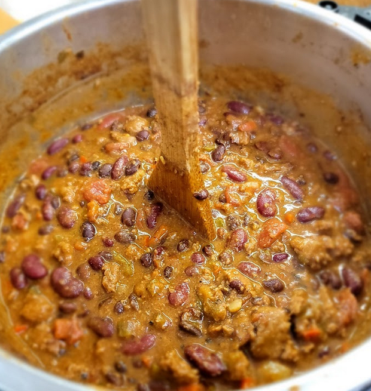
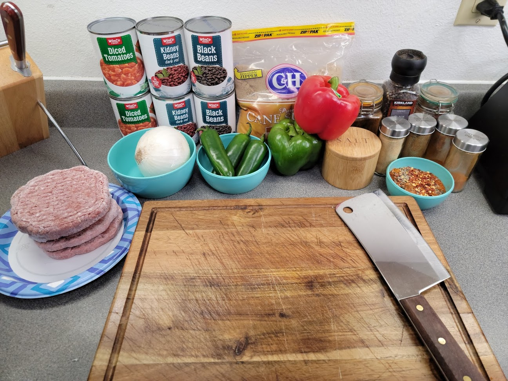
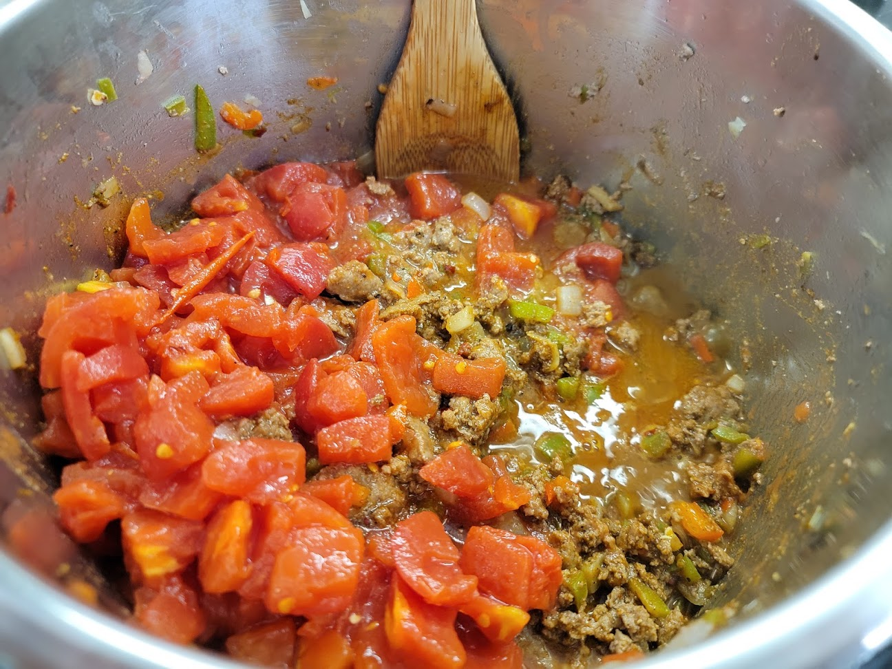
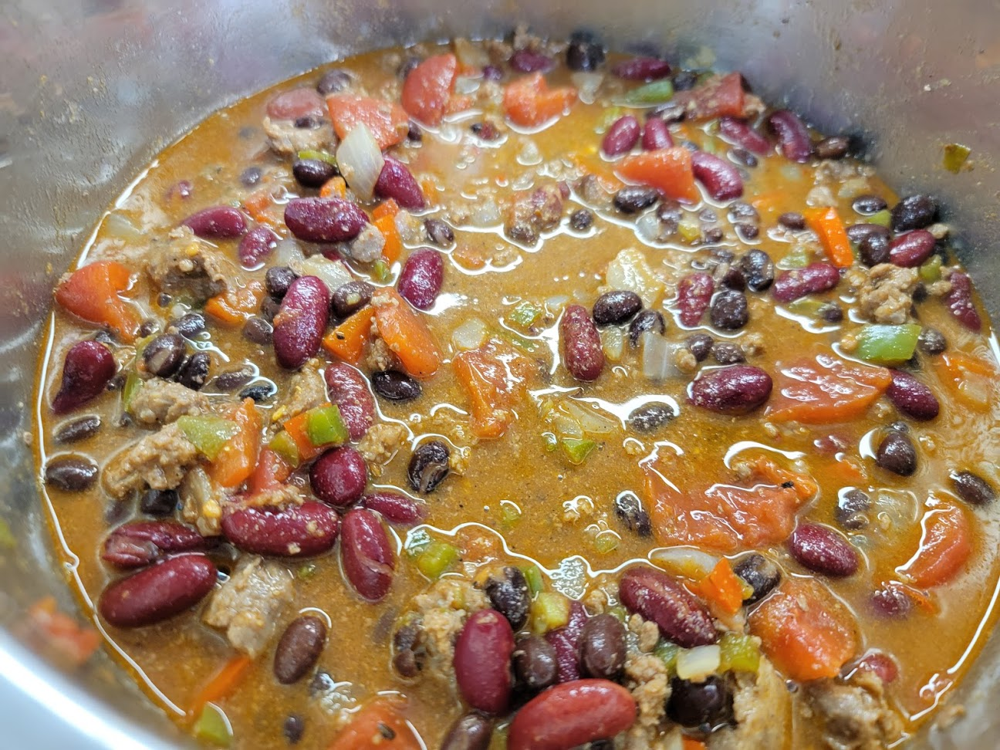

# Tavern Chili
> By: Donald (ex-tavern cook)

So you prepped too many things and need some way to use it all up?!

Well, say no more, you too can learn the ways of the Tavern.

Say it with me: _C H I L I_. Now hold on, don't be like that. We used quality ingredients! Only the best restaurant quality ground chuck and onions from the most enormous bulk box we could get our hands on! We sourced the finest bulk spices scoured from all over the local restaurant supply vendors.

Then yes, sometimes it would just acquire extras:
- Too many peppers were prepped for quesadillas? **Chili**
- Too many hamburger patties pressed out? **Chili**
- Too much steak? **Chili**

It's the perfect receptacle of things you need to get rid of, and this is how **WE** did it.

## Ingredients

- 2 lbs Beef, Ground
- 1 Yellow Onion
- 2 Jalapeños, finely diced
- 2 cans (15.5 oz each) Kidney Beans
- 2 cans (15.5 oz each) Black Beans
- 1 can (15.5 oz) Crushed Tomatoes
- Water as needed

## Seasonings

- 1 tsp Cayenne Pepper
- 1 tsp Smoked Paprika
- 2 tbsp Cumin
- 2 tbsp Ground Chili
- 1 tsp (+ a pinch here and there while cooking) Salt and Pepper
- 1/8 cup (or to taste) Brown Sugar
- ½ tsp Oregano
- ½ tsp Garlic Powder
- ½ tsp Onion Powder

## Preparation Steps

Let's get all set up!

~snaps fingers~

BAM! Nailed it, look yes, those are frozen hamburger patties; I said you can just get rid of stuff with chili, plus we're in my home kitchen; I'm not that fancy.

1. **Prep your onions**: About 1/2" diced is fine; they don't have to be small; just try and get consistent.
 
2. **Peppers**: Same deal; just try and get them consistent.
3. **Jalapeños**: Jalapenos are up to you! If you listen to your heart yearns, the Jalapenos will tell you the spice level you crave. This will add a little bit of heat; you can adjust by taking out the seeds or adding more.

4. **Spices**: We always prepped these portioned out into a container, then added them and mixed them right before we added in the tomatoes and beans. I prefer to get a couple different kinds; here, I used a mix of the powder from the Winco bulk bin and some New Mexican ground chili from those green topped spice baggies you get from the store… I don't remember the brand. These will be a bulk of your flavors, you could even make your own, but that is outside of the scope here.

### Cooking
- Add your onions to a pan on medium-high, season with salt and pepper, and sauté until translucent and starting to brown. Add in your peppers and continue to sauté lightly before adding your raw meat.

- While waiting for the meat to brown, rinse your beans. At the Tavern, we used giant cans and just to make sure they were rinsed right, we would rinse them in equally giant colanders.
- When your meat is browned, skim ~75% of the liquid, then add in your spices and brown sugar, stir to mix.
- Add the whole can of tomatoes, stir to combine.

- Then pour the beans into the pot, gently stir so you don't break them too much until they are well mixed. Fill water to just under the top (you could use some of that liquid you skimmed if you want).

## Cooking Time

Now it is time to bring it to a simmer and leave it uncovered, then wait… and wait… and honestly, it wouldn't hurt to wait some more. Adding more time will do nothing but good things to the flavor here. Two to three hours at a nice low simmer would be ideal! The Tavern usually only managed about an hour at slightly above a simmer, though, use of the 3 working burners was precious, and they really only worked at medium-high or higher R.I.P. While you are waiting, why not make yourself your favorite drink from the selection Kayla has posted! I am sure you deserve it.

## Finishing Touches

Is your chili done? Your spoon stays standing up in the center of it? Now what? Well, you should probably taste it, see if it might need something… it needs something? If you don't know what it is that it still needs, in my experience, it is salt. I will deeply miss having someone ask you to taste something because it is missing something, then seeing the look on their face when you ask if they added salt. Because you know they forgot.

## Serving Suggestions

NOW you are done, what do you do with it now? Well, you eat it; obviously, all of it, at once, in just… the most enormous bowl you can find. Then you go crawl into a corner and regret all your decisions up until this point. You could also just heap ladles full onto a large pile of fries or tots, smother it further in cheese and olives and then proceed to eat all of it… this story
