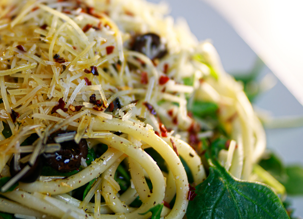
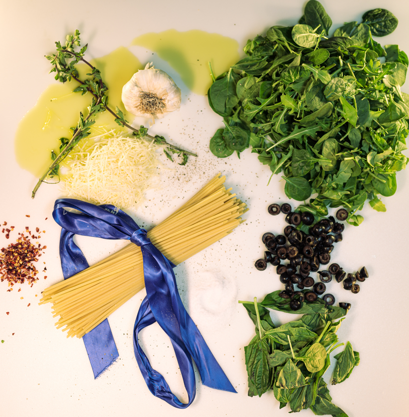

# The Alchemist Pasta

> By: Kayla

The first food item on the business plan for AFK was the Alchemist Pasta when we assumed we'd have a small bar menu. When I came up with the concept for AFK I didn't intend to have a full menu. That came as part of the WSLCB regulations. The Alchemist Pasta was simply a dish I learned to make as a kid. I made it pretty consistently at parties as it was an easy dish to prep ahead of time and be brought to people's houses.

This pasta posed many problems for a few of the Tavern's cooks and was only available for a couple of years. However, it laid the groundwork for the Firebat, and that was one of the more legendary things AFK made. It has been one of the items people have begged to bring back numerous times over the last ten years. But alas, it was never meant to rejoin the menu. I genuinely wish it could have; it was a personal item for me, but c'est la vie.

My favorite weird fact about it is that it somehow was still in many pictures of our menus online on some websites that didn't bother updating much. So we'd get someone about once a month trying to order it over the phone. It was always nice to think people still wanted it after all that time.

I retained a lot of cooking information from my childhood. Alchemist pasta was first taught to me as a kid and referred to as Thieves Pasta; as a kid in love with the archetype of noble thieves from fantasy novels, I always connected with this dish and have been making it since then. It's a quick dish and easy to modify to add your favorite protein or take out parts you don't enjoy, so play around with it some. There are no wrong answers with this dish.

Alchemist Pasta (Serves 3-5 people)

- Thick Spaghetti (Or if you'd like Thicc)
- Arugula (About two handfuls or 2 cups)
- Baby Spinach (About two handfuls or 2 cups)
- 6 oz of Olive oil
- 2-10 peeled garlic cloves (depending on how much garlic you enjoy)
- Red Pepper flakes (as many as you're comfortable with, I use about 3 oz)
- Parmesan Cheese
- Fresh Basil about 5-10 leaves
- 2-4 fresh sprigs of Oregano
- One small can of Olives
- Optional Capers

First, cook the spaghetti until it is al dente, then strain it, rinse it, and set it aside.

Next, we make the oil.  We have a few methods here, so use the one that works best for you. I've used all of them and prefer the pan method. In a small saucepan, pour in the olive oil, then add the garlic and red pepper flakes. Add a small amount of salt and pepper, then turn on your heat. Roast the garlic in the oil till brown, but careful not to burn any of the red pepper flakes. This step may require medium heat or taking the pan on and off the heat till you get the hang of it. Alternately you can do this in the oven at 300 for ~20 minutes. I check every few minutes after 20 till they are browned. A third alternate method is using a small slow cooker on high overnight. Any way you do it while the oil is cooling, add in the oregano and basil whole (so you can take them out before mixing in with the rest of the dish)

While the oil is cooling, roughly chop some of the basil leaves, then add them to the Baby Spinach and Arugula in a large bowl. Toss the greens until they are thoroughly mixed. Next, add in the mostly cooled pasta (it's okay if it's still a little warm. That's preferred.) Toss until evenly mixed. Next, add the warm oil mix (not hot), cheese, and olives. Keep tossing till everything is mixed. Evenly divide onto plates, garnish with some extra cheese and capers! Enjoy!