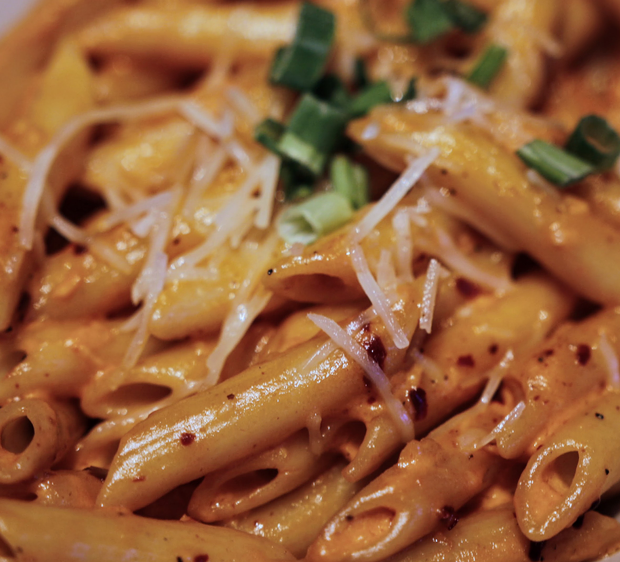
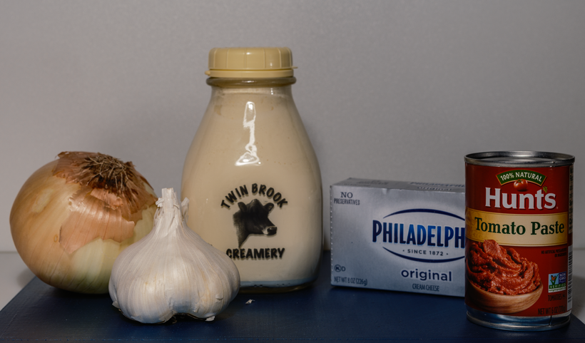
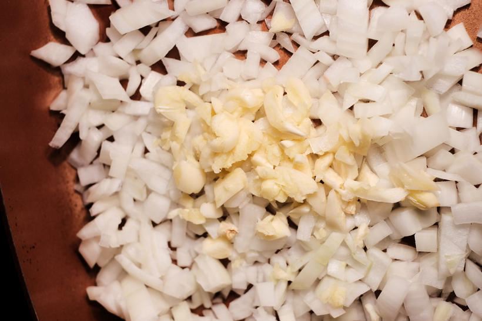

# Firebat Sauce 

> By: Kayla
_Okay the real reason most of you clicked though this website or even think of the Tavern is right here, you can stop wondering, here it is._

## The History

This history of Firebat comes from one of our first Kitchen Managers. We were removing the Pixie Pasta, an unpopular cold pasta salad dish, from the menu and wanted to replace it with something that would keep the required amount of entrees on the menu for our permits. The KM at the time suggested this spicy vodka cream sauce he had learned when he was younger. He made up a batch for everyone, and we all loved it.

The first versions of Firebat contained Sky Vodka, and due to the vodka being lit on fire during the cooking, it was named Skyfire. However, we had already called our salsa that, and no one wanted to cause more confusion on our menu. Like many Tavern foods, the original sauce was also spicy. Because of the spice and flames, I put the name Firebat, named after the Starcraft Unit, as the working title when typing up the first new menu. It stuck.

And the most universally popular dish at the Tavern was born. This food had its following outside our regular customer base. People came in just for it, weekly, some daily. It is the single most asked-for thing that came from my little bar.

## How to make it

Let's get to making it shall we? I posted the restaurant scale batch instructions a month or so back. Firebat was always a rough recipe to scale down, as it never tasted as good in a small batch. So if you want all the original taste, make the big version.

     
- Olive oil 2 tbsp 
- Yellow Onion Diced 1/4 cup
- Garlic, Minced 1/4 cup   
- Salt 3/4 tsp
- Black Pepper 3/4th tsp 
- Oregano 3/4th tsp 
- Vodka (mid-shelf) 2 oz
- Cream Cheese 6 oz
- Tomato Paste 4 oz    
- Heavy Cream 1 quart

Saute the onion, salt, pepper, oregano, and garlic in the oil till translucent and or slightly caramelized. Add in the vodka and bring to a simmer; ignite if you're brave. Then reduce heat. Mix in soft cream cheese and tomato paste and stir until combined.

our in heavy cream while stirring and increase heat. Use an immersion blender to smooth it out. Then remove from heat. Let stand in a shallow pan for ~10 minutes and chill overnight in a cooler.

When ready to serve, combine with cooked pasta in a saute pan, bring to high heat, add chili flakes and powder to your liking of spice level (optional add your choice of protein), thoroughly coat all the noodles, and reduce the sauce slightly. Then serve.

## Alternative Methods
At E&E often double the amount of oregano and added basil. The Onions were cooked with oil and butter, plus the cream cheese was baked and browned before adding. Sometimes white wine would be added along side the Vodka.

For a short time, we used sweet onions and not just regular yellows. During this time, the cooks often caramelized the onions. It gave the Firebat a richer taste.

Whiskey bat only happened once; if you've wanted to mess around with some of the flavors, try swapping out the alcohol! We did play around with adding wines and various other things. None of it stuck around.

_Bonus the full batch version:_
[fullbat](images/fullbatchbat.bmp "Batchy")