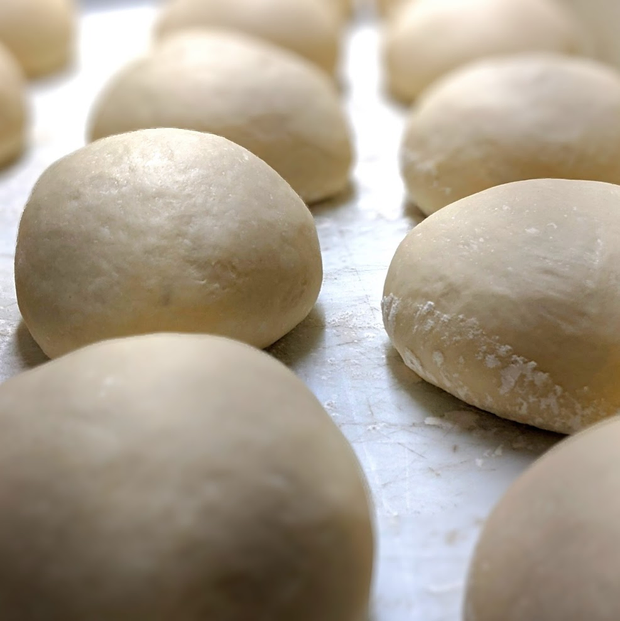
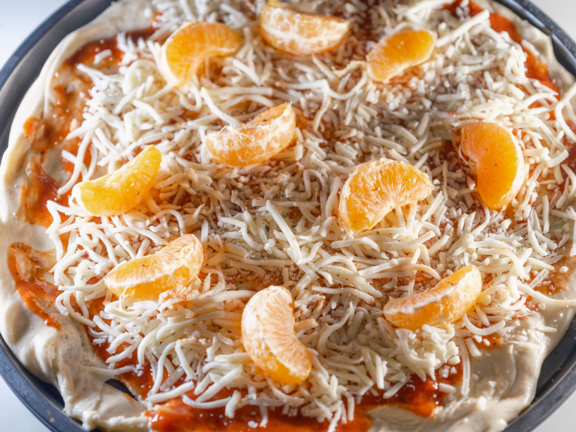

# AFK Pizza Dough
> By: Donald (ex-tavern cook)

Did you ever imagine the AFK kitchen looking like a battleground? Imagine flying pizzas flung at supersonic speeds crisscrossing the sky, and gloves fluttering to the ground, casualties of an oven explosion. I didn't until I saw it for myself. Alright, that's a bit of an exaggeration, but Kayla asked me to be entertaining, damn it.

I joined the Tavern to help improve consistency in our prep items. You might know my work, such as bringing back the thick french fries, making the chili badass, and ensuring your steaks were the right thickness. During my tenure, we had two different kinds of pizza dough; let's explore both of them, why they took so long to cook, and how you can best recreate them at home.

### The First Dough: Herb Dough

We stopped using this due to some equipment malfunctions that we never replaced. Start with five pounds of flour—though you'll likely need less unless you're feeding a restaurant!

#### Equipment Needed

- Your hands
- A metal bowl
- Measuring utensils
- Metal pie pan
- Oven

(Note: The type of pan we used was indeed a pie pan. Background info on ovens: Pizzas took long because our oven barely worked. We went through three in the time of making pizzas, and they are expensive.)

### Parm 'n' Rosemary Pizza Dough

- **Flour:** 18oz
- **Sugar:** 4tsp
- **Salt:** 2/3rd tsp
- **Yeast, active dry:** 1.5 tsp
- **Olive Oil:** 1oz
- **Rosemary:** 1 tsp
- **Parm:** 1/8th cup
- **Water (105°F):** 5.1oz

### The System is Down Pizza Dough

- **Flour:** 18oz
- **Sugar:** 4tsp
- **Salt:** 2/3rd tsp
- **Yeast, active dry:** 1.5 tsp
- **Olive Oil:** 1oz
- **Water (105°F):** 5 oz

#### Steps to Make Dough

1. Mince your rosemary and Parmesan cheese finely (use a blender, food processor, or coffee/herb grinder).
2. Dissolve yeast in the water, then combine with the rest of the ingredients.
3. Gently mix the yeast into your warm water to wake it up, then mix in the rest of your ingredients. If unsure about your yeast's freshness, proof it by mixing the sugar into your yeast and salt and letting it sit for 5-10 minutes. If it creates bubbles, you're good; if not, you need new yeast!
4. Mix by hand until combined, then knead on a lightly floured surface for 10-12 minutes until it springs back when lightly pressed.
5. Place the dough back in the bowl, let it rise covered on the counter until doubled in size, about an hour.
6. Divide into ~9oz balls, tucking the edges under to create a smooth surface.

Alright, well, we have our dough, now what? THAT'S IT. YOU HAVE PIZZA; IT'S MAGIC!

Oh, maybe we should put toppings on it…FINE, be that way. Using only your finest mass-produced restaurant-quality ingredients, we will find a way to do this.

#### Okay I guess we can make a pizza
Let's start by flipping that oven to 425° F and letting it pre-heat then; we will move onto forming out our dough. To do that, we will be throwing it up into the air with a twist of the wrist, and I know you wanted to do that…It's stuck on the ceiling? Don't worry; it happens to the best of us, okay we will do it the boring way.

Lightly oil (We used olive oil) your pie pan and set your dough into the center. Using your palm, press the dough down and towards the edge of the pan. Then rotate your dish and repeat until you have the pan mostly covered. Using your fingertips, work it from the inside out until it reaches the edge of the pan. Cover with a light layer of your pizza sauce of choice, a nice layer of shredded low moisture mozzarella cheese, any toppings you want on your Pizza, another sprinkle of mozzarella, and a sprinkle of shredded parm to finish off the top. We will go over our toppings in another article. 

I don't want the thick pan-style Pizza, you guys had a thin crust, and it was what I always ordered! I hear you; you'll need a pizza pan or a cookie sheet for this style. Lightly oil it, and we use the same method of pushing towards the edge as we did in the thick version…only we have to go so much further, stretch it out MORE, get it out to about 12 inches. The same amount of dough, but you get way more coverage. For some reason, though this one always took longer to cook, this makes little sense, we never figured out why the kitchen violated the laws of physics.

_(Kayla is an actual monster, and made her pizza from these instructions with tangerine slices. Seriously Bartenders are strange people.)_
Is that oven pre-heated? Great, slide er' in there for 10-15 minutes, it will be done when the crust is golden brown, and the cheese is bubbly and starts to pick up some of that golden color.

**bam! pizza**

#### Bonus Content

Kayla discovered a video while digging through archives for pizza-related content. It features Manager TJ teaching cooks how to make the pizza in the old days.

[Watch the video here!](https://youtu.be/ZPUBA6rIADU)

#### Large Batch Recipe: Parm ‘n’ Rosemary Pizza Dough

- **Flour:** 81oz by weight
- **Sugar:** 6 Tbsp (2.5 oz)
- **Salt:** 2 Tbsp (1 oz)
- **Yeast, active dry:** 4 ½ Tbsp (1.25 oz)
- **Olive Oil:** 1 ¼ Cups (9 oz)
- **Rosemary:** 4 TBSP
- **Parm:** 1 cup
- **Water (105°F):** 46oz by weight

